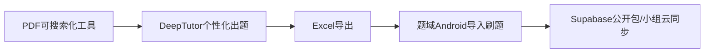
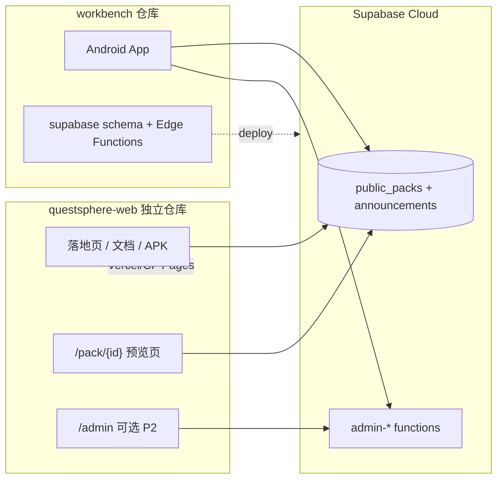

---

name: 官网仓库策略

overview: 推荐 Phase 2.8 官网作为**独立 npm 项目/独立仓库**（本仓库 QuestSphere-web），部署到 Vercel 或 Cloudflare Pages；Supabase 继续留在 workbench，Web 只通过 anon REST 对接。**官网 IA、主转化与切片以 `docs/website-decisions.md` 为准**；本文档侧重 workbench 背景与 API 边界。

todos:

  - id: create-web-repo

    content: 新建 questsphere-web（Astro + Vercel/CF），配置 PUBLIC_SUPABASE_URL/ANON_KEY

    status: completed

  - id: landing-docs

    content: 落地页 + /docs + /download + /packs 骨架页

    status: completed

  - id: homepage-p0a

    content: 首页 P0-a：Hero CTA 层级 + #ecosystem（见 website-decisions §2.1、§6.1）

    status: pending

  - id: pack-preview

    content: /pack/[packId] 预览（前 3 题含选项+解析 + onboarding，见 website-decisions §5.4）

    status: pending

  - id: featured-pack-content

    content: 首包 10～15 题上架 Supabase（tags official+featured+demo）

    status: pending

  - id: packs-featured-section

    content: /packs 官方精选分区 + 首页精选卡片（依赖 featured 包）

    status: pending

  - id: link-from-workbench

    content: workbench README / App 关于页增加官网与分享链接说明

    status: pending

  - id: web-admin-optional

    content: （P2）同域 /admin 复用 admin-* Edge Functions

    status: pending

isProject: false

---

# 题域官网：独立项目 vs 本仓库

---

## 项目背景（给网站开发 Agent 读）

> **主仓库路径**`E:\QuestSphere\workbench`（Android Kotlin + Supabase，无 Web 前端）  

> **本文档用途**：官网 Agent 不必先读全仓 Android 代码；以下足以理解产品定位、数据边界与 API 对接方式。

### 1. 产品是什么

| 项            | 说明                                                             |

| ------------ | -------------------------------------------------------------- |

| **中文名**      | 题域                                                             |

| **英文名 / 包名** | QuestSphere`com.questsphere.domain`）                          |

| **形态**       | **Android 刷题 App**（Jetpack Compose + Room），非 Web 刷题产品          |

| **战略定位**     | 一条龙链路的 **「练习与沉淀层」**：进度、错题、模考、共享题库；**不替代** PDF 工具或 DeepTutor 出题 |

| **目标用户**     | 自学者、备考者；作者侧为白名单设备可提交公开包；管理员设备可审核                               |

**一句话**：Excel/DeepTutor 出题 → 题域导入刷题 → 可选发布到「发现题库」供他人订阅；小组用邀请码协作，与公开包是**分叉模型**（见下）。

### 2. 一条龙生态（官网叙事可用）




- **PDF 工具**：独立仓库 [PDFSaaSDesktopOCR]([https://github.com/JamesJen627/PDFSaaSDesktopOCR)（桌面]([https://github.com/JamesJen627/PDFSaaSDesktopOCR)（桌面](https://github.com/JamesJen627/PDFSaaSDesktopOCR)（桌面)) OCR，非本仓）
- **DeepTutor**：自研出题补丁（题域仓内无代码）；官网文档可链到说明/模板
- **题域 App**：本 workbench；本地 Room + 可选 Supabase 云

官网落地页应讲清这条链。**主转化路径以 [`docs/website-decisions.md`](../website-decisions.md) 为准**：体验官方精选包 → 预览 → 文档 → 下载 App（非「先下载再导入」）。

### 3. App 核心能力（已实现，官网勿重复做 Web 版）

**本地刷题（Phase 0–1 基础）**

- Excel 导入（Apache POI）、分类/批次、顺序练习、模考、错题本、收藏、数据大盘
- 技术栈：Kotlin、Compose、Room、Hilt

**学习小组（邀请码闭环路）**

- 邀请码加入；OWNER/ADMIN/MEMBER；小组内题库**可协作编辑**
- `.qspack` 文件导入导出；Supabase `group_packs` 云同步
- 小组 PK（Realtime + 本地）

**公开包 / 发现题库（Phase 2，已实现）**

- **发现 Tab**（嵌在「小组」页上半区）：浏览/搜索 `public_packs`
- **订阅并导入**：快照写入本地 category`groupTag = public_{packId}`
- **版本更新（2.6）**：云端 `version` 升高后 App 提示覆盖导入；保留错题/收藏（按 `externalId`）
- **作者提交审核**：白名单 `device_id` → `public_pack_submissions` → 管理员批准 → `public_packs`
- **小组 ↔ 公开包桥接（2.5）**：小组可「提交公开包」；公开包可「复制到小组」可编辑副本

**开发者运维（App 内，非 Web v1 必做）**

- 设置 → **开发者控制台**`role=admin` 设备）：全量审题、批准/拒绝、下架+平台公告
- 6 个 Edge Functions（见下）；日常运维见 `[supabase/scripts/README.md](E:\QuestSphere\workbench\supabase\scripts\README.md)`

**平台公告（2.0 运维配套）**

- 表 `platform_announcements`；App **消息 Tab** 只读展示；下架公开包时自动发公告（模板：保留本地题）


### 4. 产品边界（官网文案与功能切分必知）

| 维度   | 公开包 Public Pack     | 学习小组 Invite Group |

| ---- | ------------------- | ----------------- |

| 准入   | 发现页/分享链接，无邀请码       | 必须邀请码             |

| 内容   | **只读快照**（version 化） | **可协作编辑**         |

| 社交   | 无成员/PK              | 成员、PK、入群通知        |

| 典型动作 | 订阅导入个人分类            | 一起刷题、改题、PK        |

**官网 v1 只做**：公开包 **只读预览** + 引导下载 App 订阅；**不做** Web 刷题、Web 登录账号、完整 marketplace。

**明确不做（路线图）**

- Phase 2 不做：Web 端完整刷题、复杂审核台、UGC 评分、付费商城（2.9 可选延后）
- v3+ 才考虑：完整产品站、Web 订阅付费


### 5. 后端与仓库分工

| 内容                     | 位置                                                                                  | 网站 Agent 是否修改    |

| ---------------------- | ----------------------------------------------------------------------------------- | ---------------- |

| Android 源码             | `[app/](E:\QuestSphere\workbench\app)`                                              | 否                |

| DB schema / migrations | `[supabase/migrations/](E:\QuestSphere\workbench\supabase\migrations)`              | 否（只读参考）          |

| Edge Functions         | `[supabase/functions/](E:\QuestSphere\workbench\supabase\functions)`                | 否（/admin P2 只调用） |

| 运维文档                   | `[supabase/scripts/README.md](E:\QuestSphere\workbench\supabase\scripts\README.md)` | 可摘录到 /docs       |

| 官网前端                   | **新建** `questsphere-web`                                                            | 是                |

**Supabase 项目**

- Project ref`ccbolmfqapdljjjqcllf`
- URL 形态`https://ccbolmfqapdljjjqcllf.supabase.co`
- Region：ap-southeast-2（悉尼）
- 密钥：从 Supabase Dashboard → Settings → API 获取；**anon key 可给官网**；**禁止**把 service_role 放进 Web 仓或 Vercel 环境


### 6. 官网可调用的 API（anon 只读）

**REST 基址**`{SUPABASE_URL}/rest/v1`

请求头（与 App 一致）：

```

apikey: {ANON_KEY}

Authorization: Bearer {ANON_KEY}

```

**列表公开包**（发现页/catalog，网站 `/packs`）：

```

GET /rest/v1/public_packs?select=pack_id,title,description,tags,author_nickname,question_count,version,updated_at&order=updated_at.desc&limit=50

```

**官方精选区**（`/packs` 置顶，见 [`website-decisions.md` §5.3](../website-decisions.md#53-tag-约定public_packstags)）：

```

GET /rest/v1/public_packs?select=pack_id,title,description,tags,author_nickname,question_count,version,updated_at&tags=cs.{featured}&order=updated_at.desc&limit=10

```

**按 pack_id 取详情（预览页必用）**：

```

GET /rest/v1/public_packs?pack_id=eq.{packId}&select=*&limit=1

```

注意`pack_id` 为 UUID 文本，PostgREST 过滤 **不要用引号包裹**（App 侧已验证 unquoted `eq`）。

**payload_json 结构**（与 `[PublicPackDto](E:\QuestSphere\workbench\app\src\main\java\com\questsphere\domain\model\publicpack\PublicPackDto.kt)` 一致）：

```json

{

  "version": 2,

  "packId": "uuid",

  "title": "...",

  "description": "...",

  "tags": ["考研", "英语"],

  "authorNickname": "...",

  "questions": [

    {

      "id": "...",

      "type": "single",

      "question": "题干（可能含 Markdown）",

      "optionsJson": "[...]",

      "answer": "A",

      "explanation": "..."

    }

  ]

}

```

预览页：**展示前 3 题**（题干 + 选项 + 解析，只读、不判题、不展示正确答案；题干去 Markdown 对齐 App `stripMarkdownForPreview`），展示 `version`、题数、作者、标签；固定 onboarding 模块见 [`website-decisions.md` §5.4](../website-decisions.md#54-预览页固定模块每个-featured-包)；CTA：**继续逛精选包**（主）/ 下载 App（次）。

**平台公告（可选 /news）**：

```

GET /rest/v1/platform_announcements?select=announcement_id,title,body,type,pack_id,published_at&order=published_at.desc&limit=20

```

RLS：仅 `select` 对 anon 开放`expires_at` 未过期或为空。

**Edge Functions（仅 P2** `/admin`**，v1 不必接）**

- 基址`{SUPABASE_URL}/functions/v1`
- 函数`admin-list-submissionsadmin-list-packsadmin-get-submissionadmin-approve-submissionadmin-reject-submissionadmin-takedown-pack`
- 鉴权：请求头 `x-device-id` + DB 中 `public_pack_publishers.role = admin`
- **切勿**在浏览器暴露 service_role


### 7. 多语言与品牌

- App 支持 **简体中文 / 繁体中文 / English**`valuesvalues-zh-rCNvalues-zh-rTW`）
- 官网 v1 建议：**默认简体中文**，结构预留 i18n；繁体/英文可 Phase 2.8+ 补
- 产品自称：**题域**；官网 v1 副标题方向见 [`website-decisions.md` §6.3](../website-decisions.md#63-全站关键文案header--footer--cta)：先体验精选题库，再导入自己的 Excel
- 主色可参考 App `[PrimaryBlue](E:\QuestSphere\workbench\app\src\main\java\com\questsphere\domain\ui\theme)`（开发时从 Compose theme 取色值）


### 8. 审核与合规（官网表述）

- 用户提交公开包 → **人工审核**后上架（非即时 UGC）
- 管理员可 **下架**；下架后云端删除 `public_packs`，**不删**用户本地题；发 **平台公告**
- 版权勾选 / 纠错举报：Phase 4 规划，v1 文档可写「提交即视为有权分享」占位


### 9. 给官网 Agent 的交付清单（Phase 2.8 v1）

> 实施顺序与切片详见 [`docs/website-decisions.md` §7](../website-decisions.md#7-开发切片)。

1. **`/`** — P0-a：Hero 主/次/第三 CTA + `#ecosystem`；P1：嵌入精选包卡片（依赖 featured 包）
2. **`/packs`** — 官方精选置顶（`tags` 含 `featured`）+ 次级全量/搜索
3. **`/pack/[packId]`** — 3 题预览（选项+解析）+ onboarding + OG meta
4. **`/docs`** — Excel 导入、DeepTutor 导出、发现/订阅 FAQ（P1 调整信息顺序）
5. **`/download`** — 次级入口；内测期说明与预览页文案一致
6. 环境变量 `PUBLIC_SUPABASE_URL`、`PUBLIC_SUPABASE_ANON_KEY`（Vercel/CF 控制台）
7. 不在 v1 做：登录、Web 刷题/答题、付费、直接写库、`/admin`


### 10. 相关文档与计划（延伸阅读）

- **官网战略与 IA（优先读）**：[`docs/website-decisions.md`](../website-decisions.md)
- 本仓库 README：[`README.md`](../../README.md)
- 路线图总览：`C:\Users\36739\.cursor\plans\题域_v2_路线图_181946b1.plan.md`
- 开发者运维与公告：`C:\Users\36739\.cursor\plans\开发者运维与公告_1bb33a6b.plan.md`
- workbench README：[`README.md`](E:\QuestSphere\workbench\README.md)（偏 Android 构建，网站 Agent 可略读）

---


## 结论（直接回答）

**官网应额外开项目**，不要放进 Android 的 `app/` 模块，也**不建议**与 Gradle 共用同一构建。

你选的 **Vercel / Cloudflare Pages** 与这一结论一致：需要一个独立的 **npm 静态/SSR 前端项目**（如 Astro 或 Next.js 静态导出），与 `[workbench](E:\QuestSphere\workbench)` 里的 Kotlin/Gradle 完全分离。

**但 Supabase 后端不要拆走**——继续留在当前 workbench 的 `[supabase/](E:\QuestSphere\workbench\supabase)`（migrations、Edge Functions、运维文档）。官网只是**消费者**。




---


## 为什么不用「全放在 workbench」

| 维度        | 独立 Web 项目              | 塞进 workbench                 |

| --------- | ---------------------- | ---------------------------- |

| 构建        | `npm run build`，秒级     | 每次改文案可能触发 Gradle/Android 上下文 |

| CI        | Vercel/CF 自动部署 main 分支 | 需自建 workflow，易与 APK 构建耦合     |

| 技术栈       | Astro/Next + Tailwind  | 与 Hilt/Room/Compose 无共用代码    |

| Cursor 体验 | 可单独开 workspace，专注前端    | 单仓 700+ 文件，搜索噪音大             |

| 2.8 目标    | 落地页 + 文档 + 预览链接        | 路线图已写「与 App 功能不重复」           |

当前 `[workbench](E:\QuestSphere\workbench)` 结构是 **Android + supabase**，无现有 Web 目录；强行 monorepo 只能加 `website/` 子目录——**可行但收益小于成本**，除非你强烈坚持「只有一个 git 仓库」。

---


## 推荐仓库边界


### 留在 workbench（不变）

- `[app/](E:\QuestSphere\workbench\app)` — Android
- `[supabase/](E:\QuestSphere\workbench\supabase)` — migrations、Edge Functions`[scripts/README.md](E:\QuestSphere\workbench\supabase\scripts\README.md)`
- 公开包数据模型、审核逻辑的后端真相源


### 新建独立仓库（建议名 `questsphere-web` 或 `questsphere-site`）

**Phase 2.8 v1 页面（1–2 周量级，细节见 `website-decisions.md`）：**

1. **/** — 生态叙事 + 主 CTA「体验官方精选题库」+ `#ecosystem`
2. **/packs** — 官方精选区 + 次级全量/搜索
3. **/pack/[packId]** — 3 题预览（选项+解析）+ onboarding
4. **/docs** — 导入模板说明、FAQ、发现/订阅说明
5. **/download** — 次级入口（内测期引导文案）
6. **（可选 P2）/admin** — 复用已有 6 个 `admin-*` Edge Functions + `x-device-id`

**环境变量（Vercel/CF 控制台配置，勿提交 git）：**

- `PUBLIC_SUPABASE_URL` — 与 App `[local.properties](E:\QuestSphere\workbench\local.properties)` 中一致
- `PUBLIC_SUPABASE_ANON_KEY` — 只读 `public_packsplatform_announcements`

**不放入 Web 仓库：**

- `service_role` key
- Android 源码、Room 实体

---


## 技术选型建议（Vercel/CF 友好）

| 方案                 | 适合                         | 说明                         |

| ------------------ | -------------------------- | -------------------------- |

| **Astro（推荐 v1）**   | 落地页 + 文档 + 轻量 `/pack/[id]` | 默认静态，按需少量 JS；CF/Vercel 都友好 |

| Next.js App Router | 以后要 SSR、复杂 admin           | 略重；v1 预览页用 client fetch 即可 |

公开包预览页逻辑可对齐 App 侧 `[PublicPackRepository.listCatalog](E:\QuestSphere\workbench\app\src\main\java\com\questsphere\domain\data\repository\PublicPackRepository.kt)` / `fetchPackDetail` 的 REST 调用，**不必**共享 Kotlin 代码；TypeScript 写 50–80 行 fetch 足够。

---


## 与已完成 Phase 2 的衔接

- **2.2–2.5 公开包 + 小组桥接**：Web 预览页只读 `public_packs`，分享链接 `https://你的域名/pack/{pack_id}`
- **2.6 版本更新**：预览页展示 `version`；Deep link 打开 App 仍可用 `questsphere://` 或 Play 链接（v1 可只做「下载 App 后订阅」文案）
- **开发者运维 P2 Web admin**：与官网**同域同项目**部署 `/admin`，复用 `[supabase/functions/](E:\QuestSphere\workbench\supabase\functions)` 即可，无需回 workbench 写 UI

---


## 若仍想「一个 git 仓库」的折中

在 workbench 根目录加 `**website/**`（独立 `package.json.gitignore` 不含 `node_modules`），Vercel 项目 Root Directory 设为 `website/`。  

**本质仍是独立 npm 项目**，只是 git 历史与 Android 在一起——适合单人、少 PR 的场景。

---


## 不建议的做法

- 在 `app/` 内嵌 WebView 当「官网」（无 SEO、无分享链接）
- 把 Supabase migrations 挪到 Web 仓（后端应跟 App 版本同演进）
- v1 就做 Web 刷题 / 登录账号体系（路线图明确 defer 到 v3+）

---


## 建议实施顺序（与 `website-decisions.md` §7 对齐）

1. ~~新建 `questsphere-web` 仓库 + Astro 脚手架 + Vercel/CF 连 Git~~（已完成）
2. ~~落地页骨架 + `/docs` + `/download` + `/packs`~~（已完成）
3. **进行中** — 首页 P0-a（CTA + `#ecosystem`）；首包 10～15 题上架
4. `/packs` 精选分区 + `/pack/[id]` 预览（选项+解析）+ onboarding
5. workbench README 增加「官网仓库」链接；APK Release 流程写进 docs
6. （可选 P2）同项目加 `/admin`，复用 Edge Functions

**预估**：v1 静态站 + 预览页约 **2–4 天**；Web admin 另计 **3–5 天**（可与 App 开发者页并行，API 已就绪）。